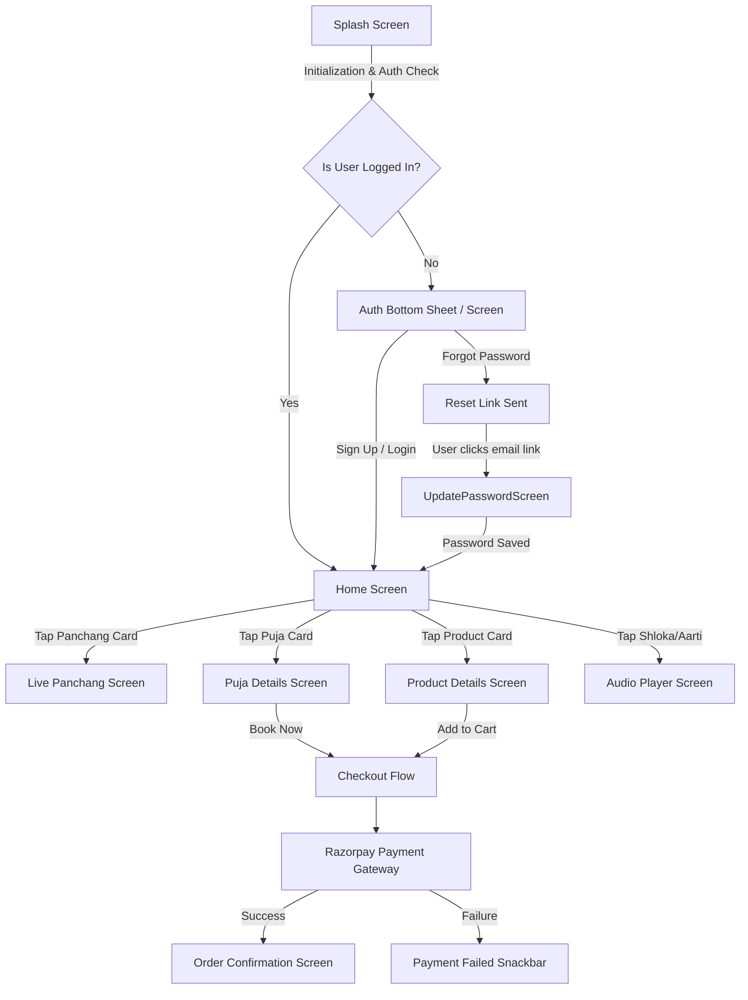

# App Flow Diagram

## 1. User Journey Flow

## 2. Navigation Architecture
- **Root Navigator:** Handles top-level transitions (`SplashScreen` -> `HomeScreen`). Also catches Deep Links via the Global `navigatorKey` (e.g., routing to `UpdatePasswordScreen`).
- **Bottom Navigation Bar (Custom):** 
  - `Home`: The primary dashboard containing horizontal carousels.
  - `Wishlist`: Saved Pujas and Products.
  - `Profile`: Settings, Orders, and Localization toggles.
- **Modals & Overlays:** Authentication, Language Pickers, and Quick-Cart interactions are handled via Bottom Sheets to keep the user anchored.
