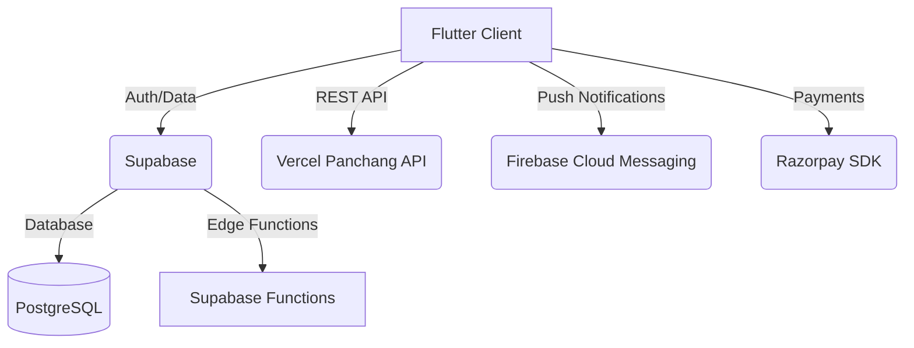

# System Architecture

## 1. High-Level Architecture
VedicReeti follows a classic Client-Server architecture utilizing a Backend-as-a-Service (BaaS) for core infrastructure.

**Client:** Flutter (Mobile App - iOS/Android)
**Backend:** Supabase (PostgreSQL, Auth, Storage)
**Third-Party Services:** Vercel (Panchang API), Razorpay (Payments), Firebase (Push Notifications).

## 2. Component Diagram

## 3. Core Modules
- **Authentication:** Managed natively via `supabase_flutter`. Includes JWT token handling and secure session restoration. Deep-link integration for password recovery.
- **State Management:** Mix of StatefulWidgets, `ValueNotifier` for global UI themes, and Singleton Services for logic (`PanchangService`, `WishlistService`, `GlobalAudioService`).
- **Data Fetching & Caching:** 
  - Centralized repository pattern (e.g., `ProductRepository`, `PanchangService`).
  - Heavy reliance on `Hive` local storage to intercept redundant network calls.
- **Audio Pipeline:** `just_audio` handles buffered streaming of devotional tracks, managed by a singleton audio controller to persist state across screens.

## 4. API & Network
- **Vercel Panchang API:** Hit once per day per session, utilizing strict `x-api-key` headers for authentication. In-memory caching ensures 0 duplicate concurrent calls.
- **Supabase DB:** Strict Row Level Security (RLS) policies govern data access (e.g., users can only read/write their own Wishlist and Bookings).
